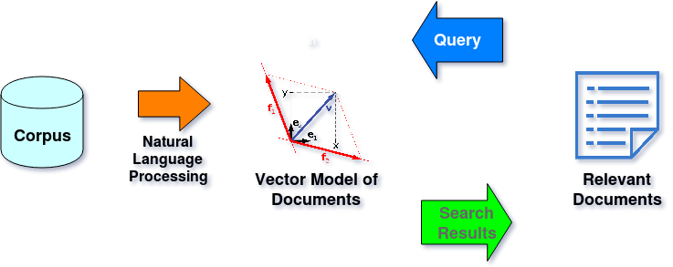

[](https://travis-ci.org/zjohn77/retrieval)



## 1. The Goal of this Project:
Implements full text search by indexing an input array of texts using the Okapi BM25 similarity.

## 2. The Design:
This function computes a BM25 document-term matrix, and stores this matrix as an array of arrays. Function's main parameter is a text document collection in the form of an array of strings--each text document here is a string.

## 3. Install:
```bash
npm install retrieval
```

## 4. Usage:

```js
const docs = require("./music-collection"); //load sample documents
const Retrieval = require("../../retrieval"); //import module

//1st step: construct an object, feeding two parameters for bm25.
let rt = new Retrieval(K=2, B=0.75);

//2nd step: index the document collection loaded above.
rt.index(docs);

//3rd step: search.
rt.search('theme and variations');
```
