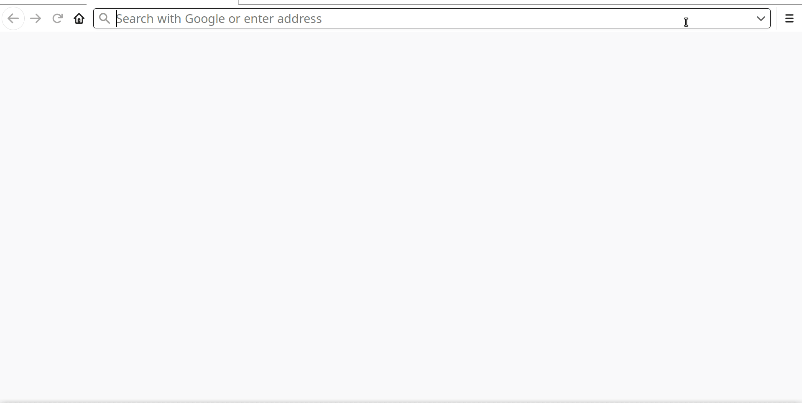

[](https://travis-ci.org/zjohn77/retrieval)

## Table of Contents
1. [Basic Idea and Key Benefits](#1-basic-idea-and-key-benefits)
2. [Deploy Full-Text Search in an App](#2-deploy-full-text-search-in-an-app)
3. [Install](#3-install)
4. [User Guide](#4-user-guide)

## 1. Basic Idea and Key Benefits:


An [Elasticsearch](https://www.elastic.co/guide/en/elasticsearch/reference/current/index-modules-similarity.html)-comparable, full-text search engine using JavaScript that leverages advanced Natural Language Processing. The [BM25](https://nlp.stanford.edu/IR-book/html/htmledition/okapi-bm25-a-non-binary-model-1.html) ranking function at the core of this project is tunable to different types of texts (e.g. tweets, scientific journals, legal writing). **Key features are**: 

* The JavaScript source code can be natively deployed on the server side to Node.js as well as on the client side in browser extensions, single-page apps, serverless, React Native, edge computing, and many other applications.
* The accuracy and versatility of BM25 comes from being able to [tune its parameters](https://www.elastic.co/blog/practical-bm25-part-3-considerations-for-picking-b-and-k1-in-elasticsearch) to specific types of documents.
* Separates offline indexing from the time-sensitive online search.
* Each individual NLP component, like the stemmer or the stopword list, is pluggable and carefully researched to keep at the bleeding edge. (For example, the stopword list is a confluence of the best words from three authoritative stopword lists: the Stanford CoreNLP, Journal of Machine Learning Research, and NLTK.)
* Dockerfile and [Docker image](https://hub.docker.com/r/jj232/retrieval) are available. Conveniently tryout the module.
* Reasonable unit test coverage, continuous integration, and separation of concerns for each functionality.

## 2. Deploy Full-Text Search in an App:



Right above is a demo Express app (see [MEAN stack](http://mean.io/)) enhanced with full-text search capability. The easy way to try this demo is to run its docker image as below, then point browser to **localhost:3000** . 
```bash
docker run --rm -d -p 3000:8080 jj232/retrieval
```

Or you can run the command below after [installing](#3-install):
```bash
npm run demo2
```
Then, point browser to **localhost:8080** . 

**Suggestions on deploying**: For integrating the module into a simple js app, the demo right here shows this to be doable in only a few lines of code--see source code at "./demo/demo2/server.js". But for a more complex software solution, or one that relies on other languages/RTEs, the recommended way is to Dockerize this module and then expose as a microservice.

## 3. Install:
For the latest release:
```bash
npm install retrieval
```

For continuous build:
```bash
git clone https://github.com/zjohn77/retrieval.git
cd retrieval
npm install
```

## 4. User Guide:
```js
const path = require("path");
const Retrieval = require(path.join(__dirname, "..", "..", "src", "Retrieval.js"));
const texts = require("./data/music-collection"); // Load some sample texts to search.

// 1st step: instantiate Retrieval with the tuning parameters for BM25 that attenuate term frequency.
let rt = new Retrieval(K=1.6, B=0.75);

// 2nd step: index the array of texts (strings); store the resulting document-term matrix.
rt.index(texts);

// 3rd step: search. In other words, multiply the document-term matrix and the indicator vector representing the query.
rt.search("theme and variations", 5)   // Top 5 search results for the query 'theme and variations'
  .map(item => console.log(item));
// 04 - Theme & Variations In G Minor.flac
// 17 - Rhapsody On A Theme of Paganini - Variation 18.flac
// 01 - Diabelli Variations - Theme Vivace & Variation 1 Alla Marcia Maestoso.flac
// 07 - Rhapsody On A Theme of Paganini (Introduction and 24 Variations).flac
// 10 - Diabelli Variations - Variation 10 Presto.flac
```
The example right above is from "./demo/demo1/scenarios.js". To run the full example, do:
```bash
npm run demo1
```
To run unit tests, do:
```bash
npm test
```